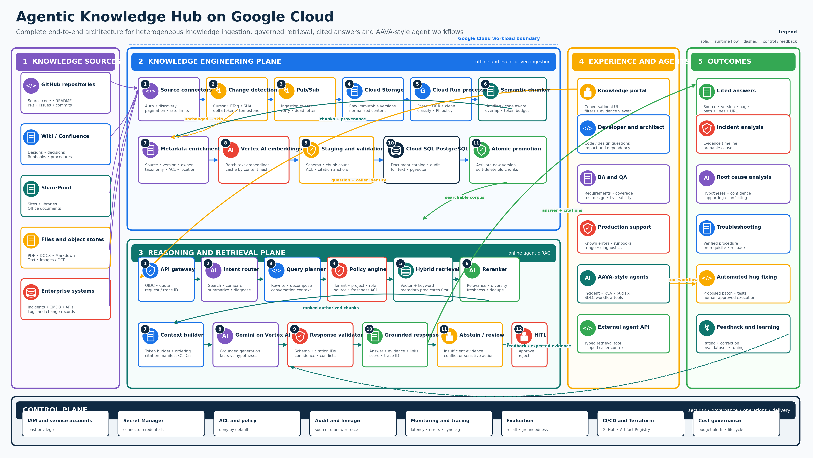

# Agentic Knowledge Hub

Agentic Knowledge Hub is a citation-first knowledge platform for developers, architects, business analysts, QA engineers, production-support teams and AI agents. Its target architecture ingests heterogeneous content, detects changes, creates provenance-rich chunks, stores embeddings, retrieves only authorized evidence and generates grounded answers.

The application is implemented in **Java 21 and Spring Boot 4.1.1**, with Maven Wrapper 3.9.11. It is also a practical learning project for senior-architect interviews covering Spring, design principles, database transactions, GCP, and Agentic AI.



## Implemented foundation

- `GET /health/live`: process liveness, independent of PostgreSQL
- `POST /v1/documents/text`: text parsing, SHA-256 checksums, deterministic word-window chunks, and citation metadata
- Text/Markdown, PDF (PDFBox), and DOCX (Apache POI) parsers at the service layer
- Citation ID validation against an application-owned manifest
- PostgreSQL 16 with pgvector, Flyway migrations, and transactional document/chunk persistence
- Java unit tests, HTTP integration tests, and a reproducible executable JAR build

**Ingestion is durable.** First ingestion returns `CHANGED`; identical content and metadata return `UNCHANGED`, including after an application restart. Changed content atomically replaces the current document's chunks and persists citation metadata. Authorization-aware keyword retrieval is available through `POST /v1/search`. Identity Platform token validation protects both APIs; embedding calls and agent execution are not implemented yet.

The current-document replacement policy does not retain old chunks for historical answers. Read the [persistence decision](docs/architecture/0002-postgresql-persistence.md) and [transaction learning guide](docs/learning/postgres_pgvector_info.md) for the guarantees and tradeoffs.

The architecture image and design PDF describe the target platform; references to the original Python stack are historical. The [Java migration decision](docs/architecture/0001-java-spring-migration.md) records the current implementation and tradeoffs.

## Local prerequisites

- JDK 21 (build target and CI runtime; the code also builds with a compatible newer JDK)
- Git
- Internet access for the first Maven wrapper/dependency download
- Docker Desktop for PostgreSQL or container execution
- Google Cloud CLI only for later GCP milestones

Maven does not need a separate installation. Run `./mvnw` on macOS/Linux or `mvnw.cmd` on Windows. Check `java -version` and `./mvnw --version` if Java or Maven startup fails. Point `JAVA_HOME` to your chosen JDK when multiple installations exist.

## Start locally

From the checkout root, start PostgreSQL first:

```bash
docker compose up -d postgres
SPRING_PROFILES_ACTIVE=dev ./mvnw spring-boot:run
```

Flyway applies V1 and V2 to a **new empty database** at startup. If this is an existing database created by the earlier Compose schema script, adopt it once:

```bash
./mvnw spring-boot:run -Dspring-boot.run.arguments="--akh.database.adopt-legacy=true"
```

Explicit adoption verifies the existing schema against V1 before recording a baseline and applying V2. Schema drift or duplicate document versions stop the upgrade for manual reconciliation. Do not enable automatic baselining or delete the Docker volume to bypass an error. After adoption, use the normal startup command. `database/schema.sql` is a legacy V1 reference; Flyway migrations are now authoritative.

If port `8000` is occupied by the earlier Python process, stop that process or run with `PORT=8001 ./mvnw spring-boot:run` and use the corresponding port in your URLs.

The `dev` profile exposes Swagger but does not bypass authentication. Follow the [Identity Platform guide](docs/learning/gcp_identity_security_info.md) to assign permissions and sign in. Open [interactive API documentation](http://localhost:8000/docs). The OpenAPI document is at [openapi.json](http://localhost:8000/openapi.json).

```bash
curl http://localhost:8000/health/live
curl -X POST http://localhost:8000/v1/documents/text \
  -H "Authorization: Bearer $AKH_ID_TOKEN" \
  -H 'Content-Type: application/json' \
  -d '{"external_id":"runbook","title":"Runbook","text":"Cloud Run hosts the API.","source_version":"1","allowed_groups":["support"]}'
```

Response fields retain the Python API's snake_case names: `status`, `content_hash`, `chunk_count`, and `chunk_ids`. First or modified nonempty input returns `CHANGED`. An identical retry returns `UNCHANGED` with `chunk_count: 0` and `chunk_ids: []`; the count means chunks produced by this operation, not total stored chunks. Empty or whitespace-only text returns `EMPTY` without changing any stored document. Metadata-only changes also return `CHANGED`. Missing required fields or malformed JSON return a sanitized HTTP 422 response. Omitted or null `source_version` defaults to `1`; omitted or null `allowed_groups` defaults to an empty list. Unknown request fields are ignored. PDF and DOCX parsers are not exposed as upload endpoints yet.

Inspect the running database:

```bash
docker compose up -d postgres
docker compose ps
docker compose exec postgres psql -U akh -d akh
```

Compose only starts PostgreSQL; it does not start the Java application. Startup requires successful database migrations. During a runtime database outage, nonempty ingestion returns a sanitized HTTP 503 while `/health/live` remains a process-liveness check. There is no in-memory fallback.

## Search locally

Search requires a verified Identity Platform ID token with `knowledge:read`, a tenant, and read groups. Ingestion additionally requires publisher permissions. Start with `SPRING_PROFILES_ACTIVE=dev` for Swagger and use its **Authorize** button with your ID token. There is no simulated identity.

Ingest synthetic documents with `allowed_groups: ["support"]`, then call:

```bash
curl -X POST http://localhost:8000/v1/search \
  -H "Authorization: Bearer $AKH_ID_TOKEN" \
  -H 'Content-Type: application/json' \
  -d '{"query":"Cloud Run deployment","limit":5}'
```

The response contains `results` with chunk text, document identity, relevance scores, and persisted citations. Queries are bounded to 500 UTF-16 code units and results to 1–20 (default 5). Empty document permissions deny access. Tenant and groups come from administrator-issued signed claims. Request fields and spoofed headers cannot change them. Read the [search and authorization guide](docs/learning/search_authorization_info.md).

## Configuration

Spring reads environment variables; it does **not** automatically load `.env`. `.env.example` documents current and reserved settings. Set them through your shell, IDE, or container configuration. For example:

```bash
PORT=8080 CHUNK_SIZE_WORDS=550 CHUNK_OVERLAP_WORDS=90 ./mvnw spring-boot:run
```

Defaults are port `8000`, chunk size `550` words, and overlap `90` words. Invalid chunk configuration fails startup. Word counts are not model token counts. Database settings are active: `SPRING_DATASOURCE_URL` (JDBC URL), `SPRING_DATASOURCE_USERNAME`, and `SPRING_DATASOURCE_PASSWORD`. Local defaults match Compose. `AKH_TENANT=local` is the default scope for internal service callers; HTTP ingestion derives tenant from validated claims. `AKH_SOURCE_NAME=manual-text` selects the source and must match the publisher grant. `GCP_PROJECT_ID` selects the Identity Platform issuer/audience (default `agentic-knowledge-hub-learning`).

The connection pool permits at most five connections per application instance. Preparation occurs outside the transaction; the write transaction uses READ COMMITTED and a 15-second timeout. Processing identity includes `PROCESSING_REVISION` (default `parsers-v1/chunker-v2`) and both chunk settings. Bump the revision when parser semantics change to rebuild unchanged source bytes on the next ingestion. Never commit real credentials.

## Validate

```bash
./mvnw spotless:apply
./mvnw verify
git diff --check
```

`verify` compiles Java, runs unit and HTTP integration tests, packages the executable JAR, and checks Java formatting. Tests use synthetic documents and require Docker. Testcontainers starts a disposable pgvector/PostgreSQL container on a random port and cleans it up; it never uses the Compose database. Tests cover fresh/legacy migrations, durable retries, replacement, rollback, concurrent duplicates, source isolation, metadata/processing changes, and an HTTP database-outage response. Missing Docker fails verification rather than silently skipping database tests. CI runs the same verification on JDK 21; no GCP credentials are needed.

## Package or run in Docker

```bash
./mvnw verify
java -jar target/agentic-knowledge-hub-0.1.0.jar
```

The multi-stage Dockerfile builds with JDK 21 and runs with a non-root JRE 21 user:

```bash
docker build -t agentic-knowledge-hub:local .
# Docker Desktop: reach the host-published PostgreSQL port from the API container.
docker run --rm -p 8000:8080 \
  -e SPRING_DATASOURCE_URL=jdbc:postgresql://host.docker.internal:5432/akh \
  agentic-knowledge-hub:local
```

The container defaults to `PORT=8080`, accepts an override, and listens on all interfaces. This prepares the HTTP application for Cloud Run's container model; deployment, IAM, secrets, and production readiness remain later milestones.

## Security and current limitations

Use only synthetic or public content in this portfolio repository. Never add HP, Ascendion, AAVA, customer, credential or personally identifiable data. The API validates Identity Platform tokens and enforces application permissions. Production deployment still needs TLS, resource/rate limits, operational monitoring and a revocation strategy.

Retrieved content is untrusted data. Citation validation checks IDs, not factual entailment or citation coverage. Parser anchors identify source sections; overlapping chunks inherit those section-level anchors. PDF layout extraction may differ from the former Python parser, and OCR, DOCX tables, and embedded objects are not supported. Chunk IDs now include tenant/source scope and processing version, so they intentionally differ from the earlier baseline. Permissions are stored on the document and keyword retrieval filters them in SQL. The dev profile only exposes Swagger; API authentication remains mandatory. Already-issued tokens are not checked for account disablement/revocation on every request. The current source lock serializes writes per source. Upstream versions are opaque strings: a delayed old update can replace current content, so connectors will need an ordering/conflict policy.

## Design

- [High-level design](docs/high-level-design.pdf)
- [Complete architecture](docs/complete-architecture.png)
- [Java migration decision and compatibility boundaries](docs/architecture/0001-java-spring-migration.md)
- [PostgreSQL persistence decision](docs/architecture/0002-postgresql-persistence.md)
- [Identity Platform authentication decision](docs/architecture/0004-identity-platform-authentication.md)
- [Authorized keyword search decision](docs/architecture/0003-authorized-keyword-search.md)

## Learning notes

- [Technical learning index](docs/learning/README.md)
- [Java, Spring, and senior-architect learning path](docs/learning/java_spring_architect_info.md)
- [PostgreSQL, pgvector, and transactions](docs/learning/postgres_pgvector_info.md)
- [GCP Identity Platform and Spring Security](docs/learning/gcp_identity_security_info.md)
- [Keyword search and authorization](docs/learning/search_authorization_info.md)
- [Docker reference](docs/learning/docker_info.md)
- [Git and GitHub reference](docs/learning/git_github_info.md)

The former Python implementation is preserved in Git history at commit `ba9447f`; it is no longer the active build. Do not use `pip`, `uvicorn`, or Python test commands to run this Java version.
